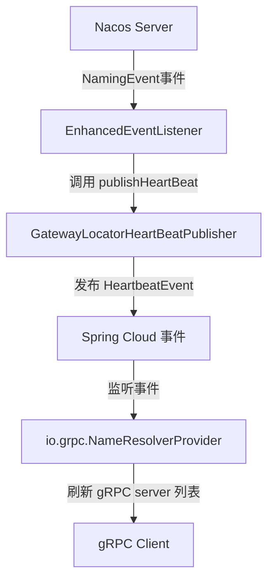

# grpc-nacos-discovery-spring-boot-starter

[](https://search.maven.org/search?q=g:io.github.bridgewares%20AND%20a:grpc-nacos-discovery-spring-boot-starter)
[](https://github.com/bridgewares/grpc-nacos-discovery-spring-boot-starter)

## 简介

`grpc-nacos-discovery-spring-boot-starter` 是一个基于 Spring Boot 的 Starter，用于帮助使用 Nacos 作为注册中心的服务快速发现
gRPC server 列表。该项目模仿了 `spring-cloud-starter-alibaba-nacos-discovery` 的实现原理，通过增强 Nacos 服务发现机制，实现
gRPC 服务的即时发现。

## 工作原理

本项目通过模仿 Spring Cloud Alibaba Nacos Discovery 的实现，实现了 gRPC 服务的即时发现。核心组件包括：

1. **EnhancedNacosWatch**: 增强版的 Nacos 监听器，负责订阅 Nacos 服务变化
2. **EnhancedEventListener**: 增强版的事件监听器，处理 Nacos 推送的服务变更事件
3. **GatewayLocatorHeartBeatPublisher**: 心跳发布器，将服务变更事件转换为 Spring Cloud 事件

### 事件流程图



### 详细流程说明

1. **第一步：Nacos 服务发现**
    - 当有新的 gRPC server 注册到 Nacos 后，会推送 `NamingEvent` 事件
    - `EnhancedNacosWatch` 通过 `NamingService.subscribe()` 订阅服务变更

2. **第二步：事件处理与转换**
    - `NamingEvent` 事件被 `EnhancedEventListener` 监听
    - `EnhancedEventListener` 接收到事件后，调用 `GatewayLocatorHeartBeatPublisher.publishHeartBeat()`
    - `GatewayLocatorHeartBeatPublisher` 发布 `org.springframework.cloud.client.discovery.event.HeartbeatEvent` 事件

3. **第三步：gRPC 服务列表刷新**
    - `org.springframework.cloud.client.discovery.event.HeartbeatEvent` 事件被 `io.grpc.NameResolverProvider` 监听
    - `NameResolverProvider` 接收到事件后，刷新 gRPC server 列表
    - gRPC Client 能够获取到最新的服务列表并建立连接

## 快速开始

### 1. 添加依赖

在您的 Spring Boot 项目中添加以下依赖：

```xml

<dependency>
    <groupId>io.github.bridgewares</groupId>
    <artifactId>grpc-nacos-discovery-spring-boot-starter</artifactId>
    <version>0.0.1</version>
</dependency>
```

### 2. 配置 Nacos

在 `application.properties` 或 `application.yml` 中配置 Nacos：

```properties
# Nacos 配置
spring.cloud.nacos.discovery.server-addr=127.0.0.1:8848
spring.cloud.nacos.discovery.service=your-service-name
spring.cloud.nacos.discovery.group=DEFAULT_GROUP
```

### 3. 启用 gRPC Nacos 发现

确保以下配置已启用（默认启用）：

```properties
# 启用增强的 Nacos 发现（默认启用）
io.github.grpc.nacos.discovery.immediate.enabled=true
# 启用 Nacos 监听（默认启用）
spring.cloud.nacos.discovery.enhanced.watch.enabled=true
# 启用 Gateway 定位器 (默认启用)
spring.cloud.gateway.discovery.locator.enabled=true
```

## 配置说明

| 配置项                                                   | 默认值    | 说明                   |
|-------------------------------------------------------|--------|----------------------|
| `io.github.grpc.nacos.discovery.immediate.enabled`    | `true` | 是否启用 gRPC Nacos 即时发现 |
| `spring.cloud.nacos.discovery.enhanced.watch.enabled` | `true` | 是否启用增强的 Nacos 监听器    |
| `spring.cloud.gateway.discovery.locator.enabled`      | `true` | 是否启用Gateway定位器       |

## 核心类说明

### EnhancedNacosWatch

增强版的 Nacos 监听器，实现 `SmartLifecycle` 和 `DisposableBean` 接口。负责：

- 订阅 Nacos 服务变更
- 管理 EventListener 生命周期
- 处理服务的启动和停止

### EnhancedEventListener

增强版的事件监听器，实现 `com.alibaba.nacos.api.naming.listener.EventListener` 接口。负责：

- 接收 Nacos 推送的 `NamingEvent` 事件
- 触发 `GatewayLocatorHeartBeatPublisher` 发布心跳事件

### GatewayLocatorHeartBeatPublisher

心跳发布器，负责将 Nacos 服务变更事件转换为 Spring Cloud 事件。该类来自 Spring Cloud Alibaba，本 starter 借用了其功能来发布心跳事件。

## 注意事项

1. 本项目依赖于 `spring-cloud-starter-alibaba-nacos-discovery`，请确保已正确配置 Nacos
2. 项目默认使用 Java 17，请确保您的运行环境兼容
3. gRPC 服务需要在 Nacos 中正确注册，并包含必要的服务元信息

## 版本历史

- **0.0.1**: 初始版本，实现基本的 gRPC 服务发现功能

## 贡献指南

欢迎提交 Issue 和 Pull Request！

## 许可证

本项目采用 Apache 2.0 许可证 - 查看 [LICENSE](LICENSE) 文件了解详情