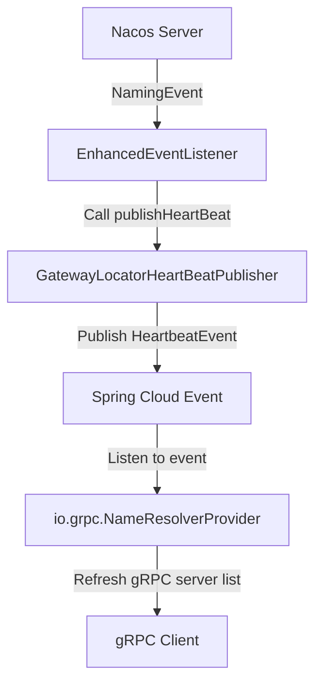

# grpc-nacos-discovery-spring-boot-starter

[](https://search.maven.org/search?q=g:io.github.bridgewares%20AND%20a:grpc-nacos-discovery-spring-boot-starter)

## Introduction

`grpc-nacos-discovery-spring-boot-starter` is a Spring Boot Starter that helps services using Nacos as the registry to quickly discover gRPC server lists. This project mimics the implementation principle of `spring-cloud-starter-alibaba-nacos-discovery` and implements immediate gRPC service discovery through enhanced Nacos service discovery mechanism.

## How It Works

This project implements immediate gRPC service discovery by mimicking the implementation of Spring Cloud Alibaba Nacos Discovery. The core components include:

1. **EnhancedNacosWatch**: Enhanced Nacos watcher responsible for subscribing to Nacos service changes
2. **EnhancedEventListener**: Enhanced event listener that handles service change events pushed by Nacos
3. **GatewayLocatorHeartBeatPublisher**: Heartbeat publisher that converts service change events to Spring Cloud events

### Event Flow Diagram



### Detailed Process Description

1. **Step 1: Nacos Service Discovery**
   - When a new gRPC server is registered to Nacos, Nacos pushes a `NamingEvent` event
   - `EnhancedNacosWatch` subscribes to service changes through `NamingService.subscribe()`

2. **Step 2: Event Processing and Conversion**
   - `NamingEvent` is listened by `EnhancedEventListener`
   - After receiving the event, `EnhancedEventListener` calls `GatewayLocatorHeartBeatPublisher.publishHeartBeat()`
   - `GatewayLocatorHeartBeatPublisher` publishes `org.springframework.cloud.client.discovery.event.HeartbeatEvent` event

3. **Step 3: gRPC Service List Refresh**
   - `org.springframework.cloud.client.discovery.event.HeartbeatEvent` is listened by `io.grpc.NameResolverProvider`
   - After receiving the event, `NameResolverProvider` refreshes the gRPC server list
   - gRPC Client can get the latest service list and establish connections

## Quick Start

### 1. Add Dependency

Add the following dependency to your Spring Boot project:

```xml
<dependency>
    <groupId>io.github.bridgewares</groupId>
    <artifactId>grpc-nacos-discovery-spring-boot-starter</artifactId>
    <version>0.0.1</version>
</dependency>
```

### 2. Configure Nacos

Configure Nacos in `application.properties` or `application.yml`:

```properties
# Nacos configuration
spring.cloud.nacos.discovery.server-addr=127.0.0.1:8848
spring.cloud.nacos.discovery.service=your-service-name
spring.cloud.nacos.discovery.group=DEFAULT_GROUP
```

### 3. Enable gRPC Nacos Discovery

Ensure the following configurations are enabled (enabled by default):

```properties
# Enable enhanced Nacos discovery (enabled by default)
io.github.grpc.nacos.discovery.immediate.enabled=true
# Enable Nacos watcher (enabled by default)
spring.cloud.nacos.discovery.enhanced.watch.enabled=true
```

## Configuration

| Configuration Item | Default Value | Description |
|-------------------|---------------|-------------|
| `io.github.grpc.nacos.discovery.immediate.enabled` | `true` | Whether to enable gRPC Nacos immediate discovery |
| `spring.cloud.nacos.discovery.enhanced.watch.enabled` | `true` | Whether to enable enhanced Nacos watcher |

## Core Classes

### EnhancedNacosWatch

Enhanced Nacos watcher that implements `SmartLifecycle` and `DisposableBean` interfaces. Responsible for:
- Subscribing to Nacos service changes
- Managing EventListener lifecycle
- Handling service start and stop

### EnhancedEventListener

Enhanced event listener that implements `com.alibaba.nacos.api.naming.listener.EventListener` interface. Responsible for:
- Receiving `NamingEvent` events pushed by Nacos
- Triggering `GatewayLocatorHeartBeatPublisher` to publish heartbeat events

### GatewayLocatorHeartBeatPublisher

Heartbeat publisher responsible for converting Nacos service change events to Spring Cloud events. This class is from Spring Cloud Alibaba, and this starter borrows its functionality to publish heartbeat events.

## Notes

1. This project depends on `spring-cloud-starter-alibaba-nacos-discovery`, please ensure Nacos is properly configured
2. The project uses Java 17 by default, please ensure your runtime environment is compatible
3. gRPC services need to be properly registered in Nacos with necessary service metadata

## Version History

- **0.0.1**: Initial version, implementing basic gRPC service discovery functionality

## Contributing

Issues and Pull Requests are welcome!

## License

This project is licensed under the Apache 2.0 License - see the [LICENSE](LICENSE) file for details
